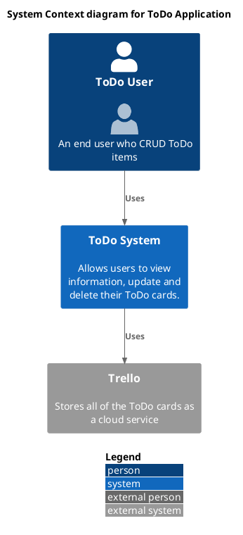
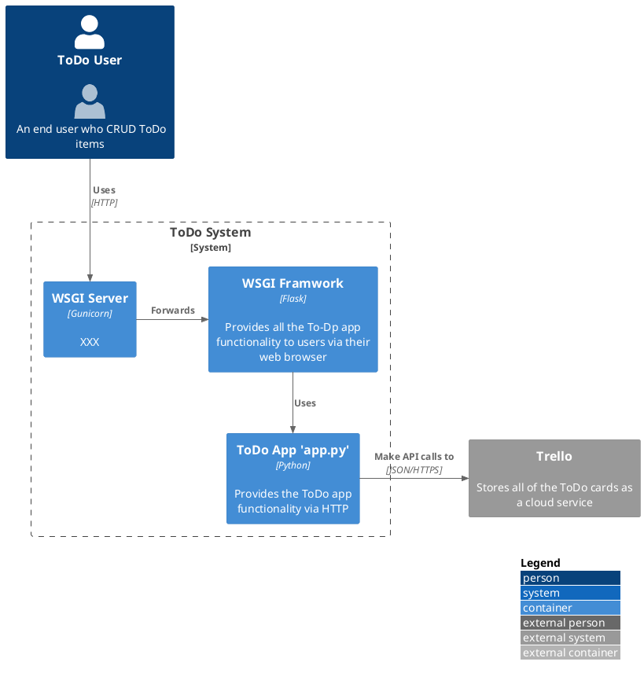

# ToDo App C4 Diagrams

## Context


```puml
@startuml
!include <c4/C4_Context.puml>  

'ref http://plantuml.com/stdlib
!include <office/Users/user.puml>
!include <office/Users/mobile_user.puml>

LAYOUT_WITH_LEGEND()

title System Context diagram for ToDo Application

Person(user  , ToDo User , "<$user>\n An end user who CRUD ToDo items" )

System(todo_system, "ToDo System", "Allows users to view information, update and delete their ToDo cards.")

System_Ext(trello, "Trello", "Stores all of the ToDo cards as a cloud service")

Rel(user, todo_system, "Uses")

Rel(todo_system, trello, "Uses")
@enduml
```

## Container


```puml
@startuml
'!includeurl https://raw.githubusercontent.com/RicardoNiepel/C4-PlantUML/master/C4_Container.puml
!include <c4/C4_Container.puml>  

'ref http://plantuml.com/stdlib
!include <office/Users/user.puml>
!include <office/Users/mobile_user.puml>

LAYOUT_WITH_LEGEND()


'title Container diagram for ToDo Application

Person(user  , ToDo User , "<$user>\n An end user who CRUD ToDo items" )

System_Boundary(c1, "ToDo System") {
    Container(gunicorn, "WSGI Server", "Gunicorn", "XXX")
    Container(flask, "WSGI Framwork", "Flask", "Provides all the To-Dp app functionality to users via their web browser")
    Container(todo, "ToDo App 'app.py'", "Python", "Provides the ToDo app functionality via HTTP")
}


System_Ext(trello, "Trello", "Stores all of the ToDo cards as a cloud service")

Rel(user, gunicorn, "Uses", "HTTP")


Rel_Neighbor(gunicorn, flask, "Forwards")
Rel(flask, todo, "Uses")


Rel_Neighbor(todo, trello, "Make API calls to", "JSON/HTTPS")


@enduml
```

## Component

```

## Code (Stretch)